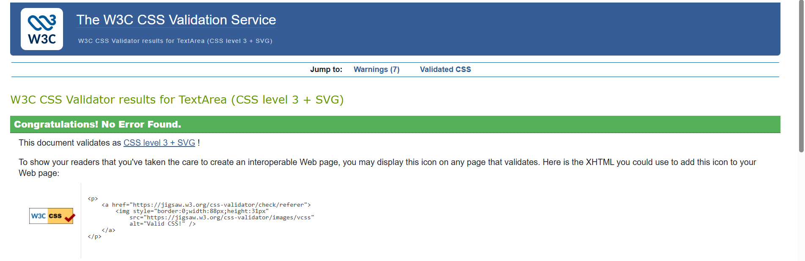

# Cricket Online Quiz

A modern, interactive cricket quiz web application that tests your cricket knowledge across different difficulty levels.

## Features

- **Three Difficulty Levels**

  - School Boy Cricket (Easy)
  - Club Cricket (Medium)
  - Professional Cricket (Hard)

- **Interactive Quiz Interface**
  - Real-time timer (30 seconds per question)
  - Progress bar to track completion
  - Visual feedback for correct/wrong answers

- **Lifelines**
  - 50:50 - Remove two incorrect options
  
  - Extra Time - Add 15 seconds to the timer
  
  - Skip Question - Skip to the next question

- **Scoring System**
  - 10 points per correct answer
  - 5 bonus points for quick answers (answered within 15 seconds)
  - Detailed performance statistics

- **Results & Review**
  - Final score display
  - Accuracy percentage
  - Complete answer review with correct answers

- **Responsive Design**
  - Mobile-friendly interface
  - Works on all screen sizes

## Technologies Used

- HTML5
- CSS3 (Custom properties, Flexbox, Grid)
- Vanilla JavaScript
- Font Awesome icons

## File Structure

```
online quiz/
|-- assets/
|   |-- css/
|   |   |-- styles.css              # Base styles and navigation
|   |   |-- quizStyles.css          # Quiz-specific styles
|   |   `-- mediaQueries.css        # Responsive design
|   `-- js/
|       |-- main.js                 # Navigation functionality
|       |-- quiz.js                 # Quiz entry point
|       `-- quiz/
|           |-- index.js            # Bootstrap and global handlers
|           |-- controller.js       # Quiz flow and scoring
|           |-- questions.js        # Question bank and shuffle helpers
|           |-- state.js            # Runtime state and constants
|           |-- timer.js            # Timer behavior
|           `-- ui.js               # DOM rendering helpers
|-- pages/
|   |-- play.html                   # Quiz page
|   `-- about.html                  # How to play page
|-- index.html                      # Home page
`-- README.md
```
## How to Run

1. Clone or download this repository
2. Open `index.html` in a web browser
3. Click "Play Quiz" to start
4. Select your difficulty level
5. Start the quiz and answer questions
6. Live Demo [Cricket online quiz](https://taruesahanga.github.io/project3-cricket-online-quiz/)

## Quiz Questions

- **Schoolboy cricket** (easy) : 10 questions about basic cricket rules and fundamentals
- **Club cricket** (medium): 10 questions about cricket history, records, and notable players
- **Professional cricket** (hard): 10 questions about advanced statistics, records, and cricket trivia

## Quiz Modules

- `assets/js/quiz.js` - module entry point
- `assets/js/quiz/index.js` - bootstrap and global handlers for inline button callbacks
- `assets/js/quiz/controller.js` - quiz flow, scoring, lifelines, and transitions
- `assets/js/quiz/questions.js` - question bank and shuffle helpers
- `assets/js/quiz/state.js` - state shape and quiz constants
- `assets/js/quiz/timer.js` - timer start/stop and extra-time updates
- `assets/js/quiz/ui.js` - DOM rendering and view helpers

## Validation

### HTML
#### Home Page


#### How to play Page


#### Play quiz Page


### CSS
#### styles.css 

#### quizStyles.css

#### mediaQueries.css


### JAVASCRIPT
#### main.js

#### quiz.js

#### controller.js

#### index.js

#### questions.js

#### state.js

#### timer.js

#### ui.js

